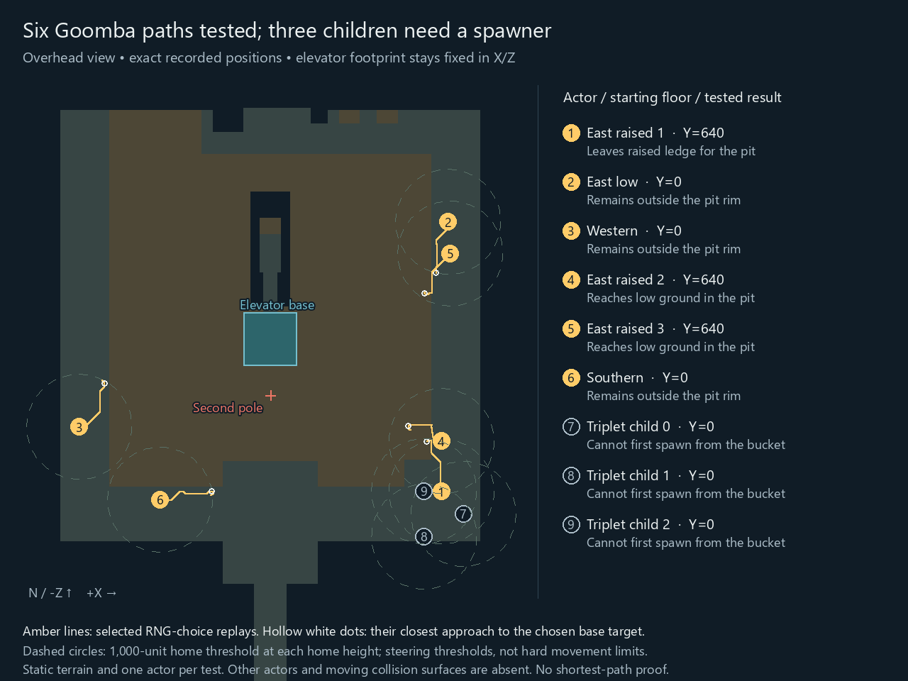
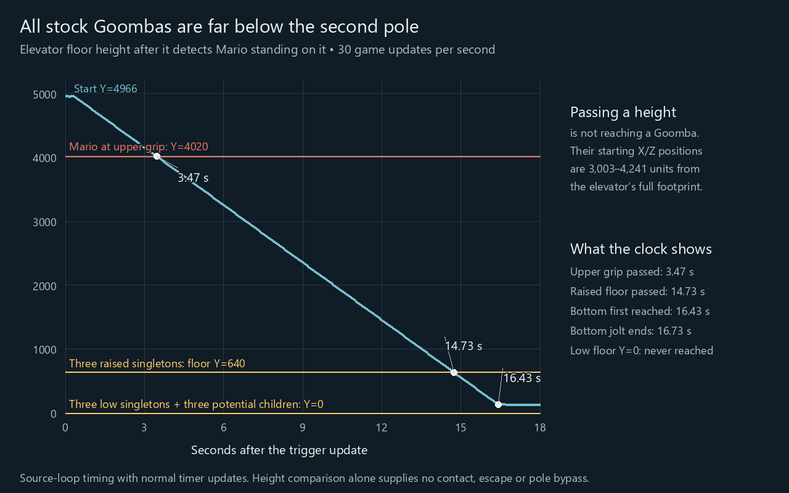

# Goombas, the elevator and the second pole

**All nine potential stock Goombas start below the second pole. None reaches
the elevator in the new bounded movement searches. The three raised eastern
Goombas do reach the lower pit in their isolated replays, so the western
Goomba is not the only actor worth investigating.** These are checked native
source diagnostics, not a complete gameplay route or an impossibility proof.

## Which actors were tested?

The game places six single Goombas and one triplet spawner. A Goomba first
drops to its floor and then sets its home there. In the checked static lists,
all three raised eastern actors therefore start walking at Y=640, even though
their placement records have slightly different heights. The other six
potential actors have a starting floor at Y=0. Every one is below both the
second pole's upper grip position at Y=4020 and its hitbox top at Y=4120;
the handstand's animation offset does not change this comparison.

| Actor | Placement `(X, Y, Z)` | Starting floor Y | Compared with second-pole top | New isolated movement result |
| --- | --- | --- | --- | --- |
| Eastern raised 1 | `(3263, 778, 3157)` | 640 | Below | Drops into the pit; closest sampled base gap about 2,863 |
| Eastern low | `(3389, 0, -1978)` | 0 | Below | Remains outside the rim; gap about 2,745 |
| Western | `(-3638, 0, 1928)` | 0 | Below | Remains outside the rim; gap about 2,663 |
| Eastern raised 2 | `(3263, 652, 2200)` | 640 | Below | Drops into the pit; gap about 2,409 |
| Eastern raised 3 | `(3431, 673, -1373)` | 640 | Below | Drops into the pit; gap about 2,461 |
| Southern | `(-2100, 0, 3316)` | 0 | Below | Remains outside the rim; gap about 2,460 |
| Triplet child 0 | `(3681, 0, 3587)` | 0 | Below | Cannot first spawn from the bucket under the stock-parent condition |
| Triplet child 1 | `(2932, 0, 4020)` | 0 | Below | Same activation obstruction |
| Triplet child 2 | `(2931, 0, 3155)` | 0 | Below | Same activation obstruction |

The gap column measures horizontal distance to the **whole elevator base**,
not distance to its center. It reports the closest sample in that finite
search, not the closest point reachable through every possible RNG sequence.
Each singleton receives eight random decisions, a 128-state beam and at most
900 updates. Choices are independently favorable outcomes available to the
real RNG; no RNG schedule is required. The source still controls turn rates,
walk timers, home behavior, wall response, jumps and partial updates. The
search aims at the closest corner of the base to each stock start. It does
not establish a globally shortest legal path.

For these comparisons, Mario's X/Z are fixed at an interior corner facing
the actor and his height follows the source elevator trace. Reaching that
corner and maintaining actual carriage remain conditions. Each actor is
tested alone against the static mesh; other actors and moving collision
surfaces are absent. A useful live continuation must account for those
effects. The searches do not cover every Mario position, prior history,
longer route or favorable collision with another actor.

The triplet parent is at `(3181,0,3587)`. Even the nearest point of the full
base footprint is about 3,882 units away horizontally, beyond the source's
strict 3,000-unit spawning threshold. Vertical separation only increases
the distance. Thus a fresh parent at that stock X/Z cannot first spawn its
children while Mario remains within that rectangle. Already loaded children
or a changed parent position would be a different setup; the roster alone
does not grant either.

The [fresh-triplet follow-up](fresh-triplet-spawning.md) now checks the
Float32 bound over the entire rectangle and proves preservation through
the inactive callback, graphics helper and relevant collision/movement
gates. The complete live-history connection remains open; these results
must not be read as a proof that every actual spawning check has those inputs.

## Does the direct western approach work?

[Watch the direct approach](../media/western-goomba-direct-rim.mp4).
The new test targets the original `(-3071,113,1928)` rim point rather than
the southern detour. Its recorded choices are a +135-degree jump turn,
a -45-degree walking turn with timer 199, and a +45-degree walking turn with
timer 100. Those are source decisions, not unrestricted steering.

At update 271 the Goomba reaches approximately `(-3150.4563,0,1918.7328)`,
about 80 horizontal units from the target. It has already encountered the
entry wall and is turning away. It never reaches the rim in this replay and
therefore supplies no elevator approach. The existing more permissive
[straight-wall closure](../../instrumentation/western-goomba-rng/README.md#straight-wall-checks)
explains why merely choosing a better ordinary jump does not clear that
isolated wall. This direct-target search retains four decisions and a
256-state beam; it is not a global shortest-path proof.

The original rim target is inside the 1,000-unit home threshold: 567 units
away horizontally, about 578 including Y. The threshold steers behavior;
it is not a hard position limit. The old broad curve was one found sequence
toward a different waypoint, not a necessary or shortest detour.
[The home-range guide](../media/western-goomba-home-range.png) and
[overlaid original replay](../media/western-goomba-home-range.mp4) show that
distinction. Both videos reconstruct recorded native positions; neither
is emulator footage.

## When does the elevator get there?

The elevator moves vertically at X=0, Z=256. It never travels over any stock
Goomba's starting X/Z. Passing an actor's height is therefore **not contact**:
the actor or its coin must still cross the horizontal gap.

| Event | Updates after the trigger | Time at 30 updates per second |
| --- | ---: | ---: |
| Elevator detects Mario standing on it at Y=4966 | 0 | 0.00 s |
| Floor first below the pole's hitbox top, Y=4120 | 94 | 3.13 s |
| Floor first below the upper grip position, Y=4020 | 104 | 3.47 s |
| Floor first below the raised Goombas' starting floor, Y=640 | 442 | 14.73 s |
| Floor first reaches bottom, Y=128 | 493 | 16.43 s |
| Bottom jolt finishes | 502 | 16.73 s |
| Floor reaches the low Goombas' starting floor, Y=0 | Never | It stops above them |

These times execute the unchanged elevator loop with the normal timer-reset
convention, starting at the update that detects Mario on it. Startup and
bottom jolts are included. Time stops or a changed elevator state require a
different clock. The earlier [live upper-elevator work](../../instrumentation/jp-rank10-upper-elevator/README.md)
remains separate from this native timing calculation.

In the selected eastern raised-2 replay, the Goomba first lands in the pit
at approximately `(3000.98,-101,1899.28)` on source update 491. At that update
the elevator base is Y=156, nearly at bottom, and the Goomba is still about
2,734 units from its footprint. The other two selected raised replays first
land on the low floor after the elevator has stopped. These pit arrivals
are concrete progress on their isolated approaches, but supply neither
an attack from inside nor a high escape that bypasses the second pole.

## What remains open?

Continue from a reached eastern pit position or another concrete approach
and establish a useful encounter while Mario remains confined. Wall turns,
the return-home behavior, other actors, live supports and the enemy's height
at the encounter still matter. To bypass the second pole by leaving the
elevator high up, a supplier must reach that upper region early enough;
none of these stock placements provides one automatically. Getting out low
down does not by itself supply the missing upper crossing.

Reproduce the checked US/JP search and timing receipts with
[`check_elevator.sh`](../../instrumentation/western-goomba-rng/check_elevator.sh).
Both versions' logs and position traces agree byte for byte, the native
undefined-behavior checks pass, and the earlier wall/jump/replay checks
still pass. This tranche adds no Coq theorem and discharges no capstone
premise. It does not change the overall Rank 10A likelihood estimate.
